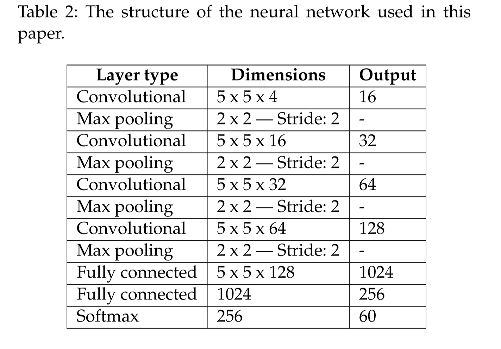
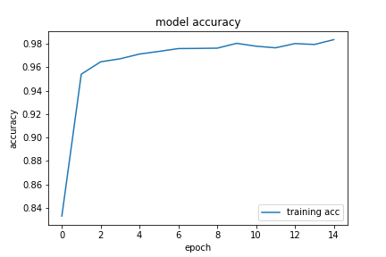
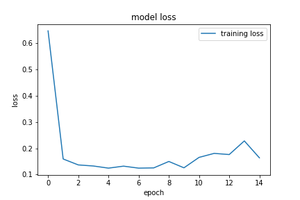

做了一个图像分类问题的练习，因为自己手边没有GPU，所以在kaggle上搭建了虚拟的计算环境。采用`fruits-360`数据集，其中有120类水果图片共60000张训练图片，12000张测试图片。

首先是自己随便搭建模型，计算效果很差，一上来就出现loss和acc都是nan的情况，关于出现这一点的原因以及如何调试我还不会，今后会继续学习。

所以就找了一篇水果分类的论文来看，论文标题`Fruit recognition from images using deep learning`，虽然论文中给出了模型的结构，但是并没有给出激活函数，优化器，损失函数，所以我就把几个常见的挨个试了一遍，发现激活函数`relu`、优化器`adam`,分类损失函数效果比较好。

论文给出的模型结构:

代码：
```(python)
from keras.preprocessing.image import ImageDataGenerator
from keras.models import Sequential
from keras.layers import Conv2D, MaxPool2D, Dense, Flatten
from keras.utils import to_categorical

ds_train = ImageDataGenerator().flow_from_directory(
    directory='/kaggle/input/fruits/fruits-360_dataset/fruits-360/Training',
    batch_size=32,
    target_size=(100, 100))
ds_test = ImageDataGenerator().flow_from_directory(
    directory='/kaggle/input/fruits/fruits-360_dataset/fruits-360/Test',
    batch_size=32,
    target_size=(100, 100))


def build():
    model = Sequential()
    model.add(Conv2D(4, kernel_size=(5, 5), activation='relu', input_shape=(100, 100, 3)))
    model.add(MaxPool2D(pool_size=(2, 2), strides=(2, 2)))
    model.add(Conv2D(16, kernel_size=(5, 5), activation='relu'))
    model.add(MaxPool2D(pool_size=(2, 2), strides=(2, 2)))
    model.add((Conv2D(32, kernel_size=(5, 5), activation='relu')))
    model.add(MaxPool2D(pool_size=(2, 2), strides=(2, 2)))
    model.add((Conv2D(64, kernel_size=(5, 5), activation='relu')))
    model.add(MaxPool2D(pool_size=(2, 2), strides=(2, 2)))
    model.add(Flatten())
    model.add(Dense(1024, activation='relu'))
    model.add(Dense(120, activation='softmax'))
    return model


my_model = build()
my_model.compile(optimizer='adam', loss='categorical_crossentropy', metrics=['accuracy'])
history = my_model.fit_generator(generator=ds_train, epochs=10)
scores = my_model.evaluate_generator(generator=ds_test)
print(scores)
```

借此机会顺便熟悉了一下python的数据分析工具，所以绘制了acc和loss的训练曲线，绘图代码：
```(python)
import matplotlib.pyplot as plt
fig = plt.figure()
plt.plot(history.history['accuracy'],label='training acc')
plt.title('model accuracy')
plt.ylabel('accuracy')
plt.xlabel('epoch')
plt.legend(loc='lower right')
fig.savefig('/kaggle/working/fruits-360-acc.png')
fig = plt.figure()
plt.plot(history.history['loss'],label='training loss')
plt.title('model loss')
plt.ylabel('loss')
plt.xlabel('epoch')
plt.legend(loc='upper right')
fig.savefig('/kaggle/working/fruits-360-loss.png')
```

acc曲线：

loss曲线：